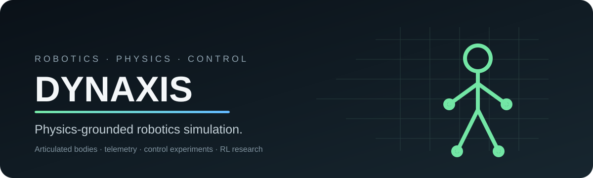
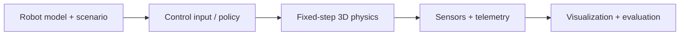

  
  
  
  
  
  

# Dynaxis

**Physics-grounded robotics simulation for articulated bodies, control experiments and reinforcement-learning research.**

Dynaxis is a research-oriented 3D robotics simulator built to observe how articulated and thruster-assisted robots respond to forces, contacts, joints and control inputs. The project combines a native inspection interface, measurable telemetry and a Python-facing experiment environment while keeping the simulated motion tied to the physics engine rather than scripted animation.

> **Public showcase:** this repository documents the project and its verified capabilities. Source code, model weights, training configurations, internal schemas, detailed parameters and private experiment artifacts are not published here.

## Highlights

| Reference build | Verified value |
|---|---:|
| Automated tests executed | **57 passed** |
| Reference humanoid | **15 links** |
| Controllable joint axes | **27** |
| Thruster channels | **4** |
| Inspected physics step | **1/240 s (240 Hz)** |

These values describe the inspected reference build and scenarios; they are not universal performance or hardware guarantees.

## What Dynaxis does

Dynaxis provides a controlled environment for studying robotic behavior before moving to physical hardware. A robot and scenario are configured, a controller or experimental policy supplies actions, the physics engine resolves the resulting motion, and the application exposes sensor-derived state and telemetry for review.

The core simulator uses explicit physical units and a fixed simulation step independent of render frame rate. Invalid or unsupported configurations are intended to fail explicitly rather than silently changing the experiment.

## Native simulator

The desktop application provides a real-time 3D viewport alongside scene inspection, controls and telemetry. The current interface exposes information such as center of mass, posture/support state, velocity and component-level inspection while a simulation is running.

The interface is an observation and experiment surface — it is not a CAD package and is not presented as a substitute for physical engineering validation.

## Current capabilities

| Capability | Status | Public scope |
|---|---|---|
| 3D rigid-body dynamics, gravity, forces and torques | **Implemented** | Physical simulation and telemetry |
| Collisions and contacts | **Implemented** | Contact-aware scenarios |
| Articulated humanoid simulation | **Implemented** | Reference articulated robot |
| Thruster-assisted variant | **Implemented** | Controlled propulsion experiments |
| Reference hover and controlled disturbance | **Implemented** | Demonstration/control scenario |
| Native 3D inspection and telemetry | **Implemented** | Desktop simulator interface |
| Vectorized Python environment | **Implemented** | Parallel reset/step loops for RL experiments |
| URDF import | **Partial** | Supported subset with explicit validation |
| PPO training workflow | **Partial** | Experimental training/evaluation path |
| Learned flight in the native window | **Unconfirmed** | Not presented as a validated result |
| Sim-to-real and multi-agent scenarios | **Planned** | Future research directions |

## Physics validation

The project is designed around measurable behavior rather than visual plausibility alone. The inspected build includes automated cases covering areas such as free fall, constant force, impulses, torque, collisions, momentum, temporal convergence, center of mass, joint integrity and propulsion-related reference scenarios.

This does **not** mean Dynaxis reproduces every effect of a real robot. Instead, reference cases are used to catch regressions and verify that known scenarios remain consistent with the intended physical model.

## Control and reinforcement learning

Dynaxis exposes vectorized experiment loops to Python, allowing multiple independent environments to provide observations, rewards and termination signals to research code. A PPO-oriented training path and checkpoints exist in the private project, but the reinforcement-learning layer remains experimental.

No claim is made here for robust learned flight, walking, large-scale training, GPU-accelerated simulation or successful transfer to physical hardware.

## Technology

**C++20 · NVIDIA PhysX 5 · Python · PyTorch · pybind11 · OpenGL · Dear ImGui · CMake**

At a public level, the architecture separates the robot/scenario definition, physical simulation, experiment/control layer, sensor-derived observations and visualization. Internal contracts and implementation details remain private.

## Design principles

- **Physics before appearance** — behavior should come from the simulated system, not scripted motion.
- **Fixed-step simulation** — physical integration is kept independent from the visual frame rate.
- **Explicit units** — physical quantities use defined units and validation.
- **Observable experiments** — telemetry makes the state of a scenario inspectable.
- **Fail explicitly** — unsupported configurations should not silently degrade into a different experiment.
- **Measured claims** — experimental or planned features are kept separate from validated capabilities.

## Current limitations

Dynaxis is a **functional research prototype**, not a finished general-purpose robotics platform. The current reference setup has a known one-articulation-per-scene limitation, URDF compatibility is selective, and the project does not claim universal robot compatibility, hardware-grade fidelity, learned locomotion, sim-to-real transfer or multi-agent simulation.

## Repository scope

This repository is intentionally documentation-only. It exists to present Dynaxis as a project while keeping the implementation private.

Not published here: source code, headers, tests, scripts, checkpoints, weights, reward definitions, curriculum/randomization settings, sensor internals, actuator parameters, detailed schemas, raw logs, private reports or internal architecture maps.

## Disclaimer

Dynaxis is research simulation software. Simulation results are not a guarantee of real-world hardware performance or safety and should not replace engineering verification, safety review or controlled physical testing.

---

Dynaxis — from control signals to physical behavior.

